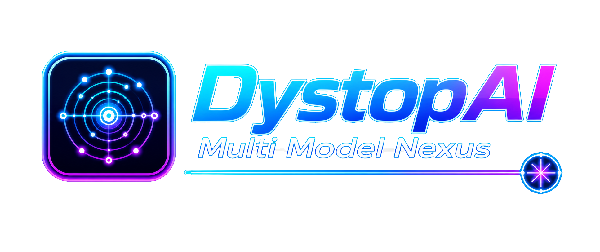
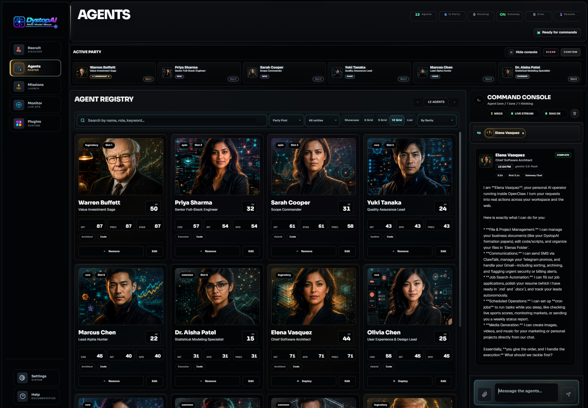
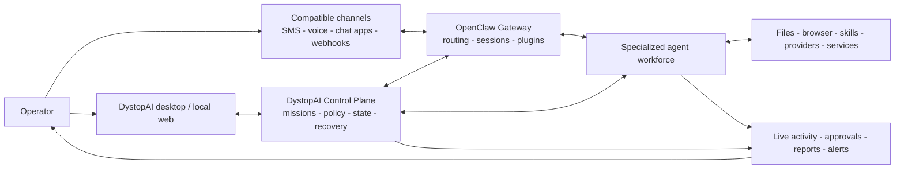
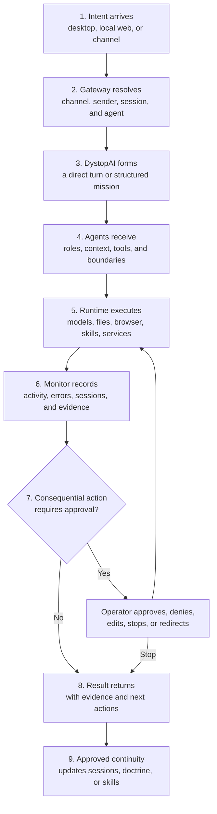
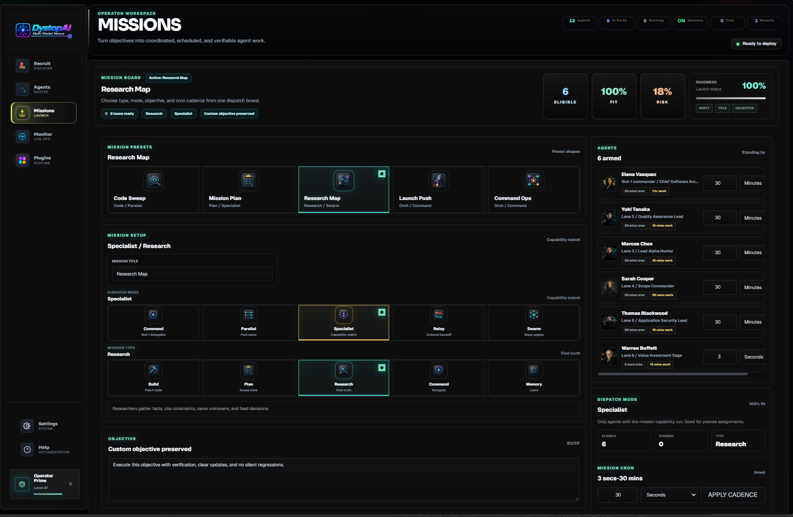
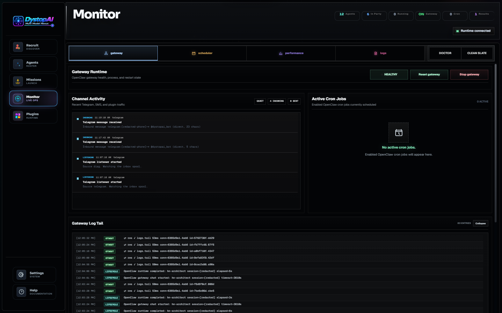
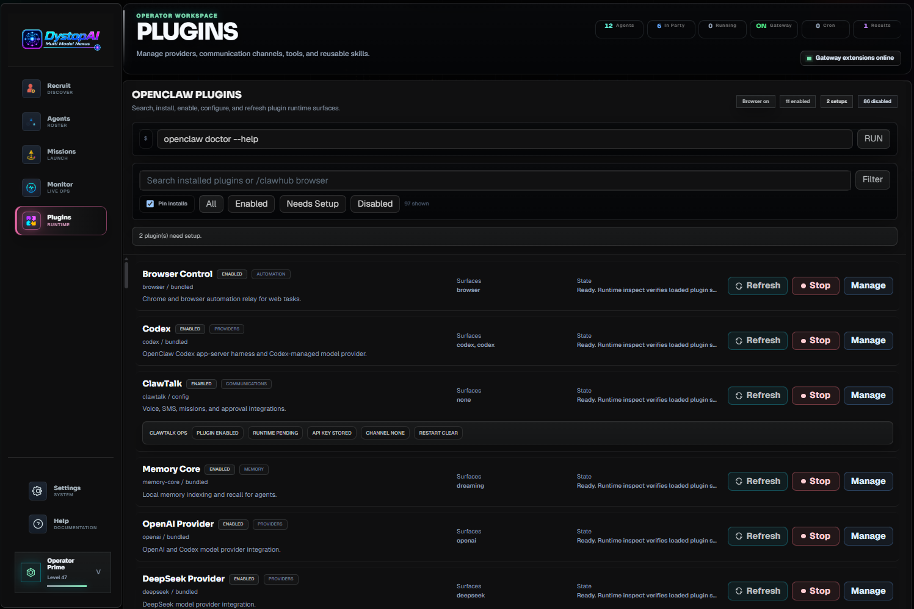
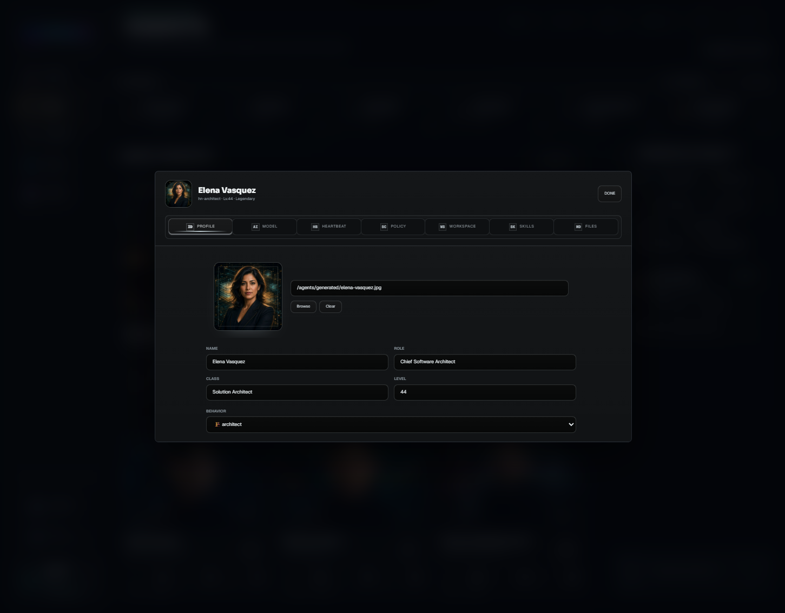
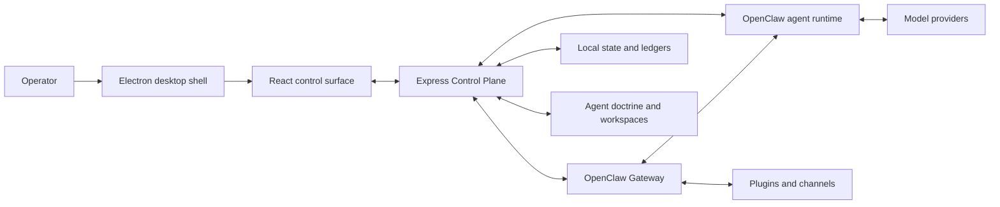

# DystopAI
> [!IMPORTANT]
> This is the public showcase and access-request hub for DystopAI. The full source code lives in the private `DystopAI-Core` repository.
>
> Request source access here: https://github.com/hotboysupreme12-hash/DystopAI/issues/new/choose
>
> Access is granted manually. Please do not redistribute private source, builds, credentials, internal docs, or repository contents without written permission.
<div align="center">



# DystopAI

### A local-first AI operations system for specialized OpenClaw agent teams

Turn intent into coordinated work. Build agents, assign missions, schedule recurring operations, connect communication channels, inspect live runtime activity, and keep consequential actions under human control.

**Multi Model Nexus** - **Local-first** - **Mission-driven** - **Channel-agnostic** - **Human-controlled**

</div>

<p align="center">
  
</p>

> [!IMPORTANT]
> DystopAI Core is a privileged local operator console. It can coordinate agents with access to files, tools, models, browsers, communication channels, plugins, and runtime state. Keep the Control Plane bound to the local machine. Remote operation should flow through authenticated OpenClaw channels or plugins, not by exposing the local API directly to the public internet.

## DystopAI In One Sentence

**DystopAI is the command network between your intent and a workforce of AI agents.**

It brings agents, missions, schedules, memory, plugins, channels, approvals, workspaces, live activity, and recovery controls into one desktop system.

A normal assistant waits inside one chat box. DystopAI is designed for work that must continue across people-like roles, tools, files, time, and communication surfaces.

## Why It Exists

Useful agent systems need more than a prompt window. They need an operating model.

| Operational layer | What DystopAI provides |
| --- | --- |
| **People** | Specialized agents with distinct roles, models, tools, policies, skills, workspaces, and doctrine. |
| **Work** | Structured missions with ownership, dispatch modes, risk settings, acceptance gates, verification, and reports. |
| **Time** | One-shot, timed, looping, watch-style, cron-backed, and recurring operations. |
| **Tools** | OpenClaw plugins, providers, browser capabilities, file access, skills, communication surfaces, and external services. |
| **Communication** | Desktop and local web control plus compatible OpenClaw channels and plugin-defined channels. |
| **Control** | Live monitoring, stop controls, approval boundaries, tool policy, sandbox policy, session cleanup, and Gateway recovery. |
| **Continuity** | Agent doctrine, workspaces, sessions, learned skills, local state, mission events, and runtime ledgers. |

The interface stays approachable, while the machinery underneath remains explicit, observable, and recoverable.

## DystopAI Capability Vision

DystopAI is a local-first AI operations system where specialized agents, missions, memory, plugins, runtime monitoring, scheduling, approvals, and communication channels operate as one command network.

| Capability | What it means |
| --- | --- |
| **Omnichannel AI command layer** | Control agents through any compatible surface, including desktop, local web chat, SMS, voice, walkie-style chat, Discord, Google Chat, iMessage, Matrix, Microsoft Teams, Signal, Slack, Telegram, WhatsApp, WebChat, webhooks, or future plugin channels. |
| **Specialized agent workforce** | Run agents as architects, builders, reviewers, testers, analysts, coordinators, marketers, researchers, assistants, operators, support agents, and automation agents. |
| **Mission-based automation** | Convert a goal into a structured operation with assigned agents, timing, risk, evidence requirements, acceptance gates, verification, and a completion report. |
| **Real-time analyst alerts** | Watch products, inventory, prices, news, competitors, launches, system health, or other business signals and deliver useful alerts through a preferred channel. |
| **Everyday life automation** | Schedule recurring work such as grocery planning, shopping lists, bill reminders, appointment preparation, meal planning, travel checks, and household follow-ups. |
| **Human approval gates** | Let agents prepare actions while pausing before purchases, messages, deployments, deletion, GitHub pushes, account changes, or other high-impact decisions. |
| **Remote operations from anywhere** | Send commands such as "check my app," "summarize today," "launch a review mission," or "stop all active runs" through a configured channel while the local runtime remains the control center. |
| **Project-aware workflows** | Operate on real folders, repositories, documents, stores, media projects, dashboards, overlays, resumes, websites, and business assets. |
| **Plugin-powered expansion** | Add communication, providers, browser automation, memory, search, files, scheduling, alerts, skills, and service integrations without redefining the core product. |
| **Continuous scheduled missions** | Run hourly, daily, weekly, cron-based, or event-driven work such as health checks, reports, content plans, release checks, reminders, and watch missions. |
| **Live runtime visibility** | See what is running, what failed, which channel initiated work, which agent responded, which tool is active, which plugin needs setup, and what requires approval. |
| **Personal AI operating layer** | Give intent once, let agents divide the work, let plugins provide capabilities, let schedules keep it moving, and retain human authority over consequential actions. |

> [!NOTE]
> Channel and approval availability depends on the installed OpenClaw runtime, operating system, plugin version, credentials, and tool configuration. DystopAI is intentionally channel-agnostic. ClawTalk is one bundled communication surface, not the boundary of the platform.

## Channel-Agnostic By Design

DystopAI should not be defined as "Telegram plus ClawTalk" or by any other fixed pair of services. The durable abstraction is a **compatible communication channel**.

The desktop app and local web surface are first-class control surfaces. ClawTalk adds SMS, voice, and walkie-style routing in the current app. OpenClaw and its plugin ecosystem can add other channels, with availability determined by the operator's runtime and configuration.



A remote command can enter through a channel, route to the correct agent, become a mission, use local or networked tools, pause at an approval boundary, and return evidence through the same communication path.

## What You Can Do Today

### Build A Real Agent Roster

Recruit and configure agents with:

- A name, portrait, role, class, level, rarity, and behavior profile.
- A primary model, fallback models, reasoning level, timeout, and provider authentication.
- A dedicated workspace plus sandbox and read/write policy.
- Tool allowlists and denylists.
- Heartbeat cadence, idle timeout, looping behavior, and recovery mode.
- Skills from the local library, learned skills, and ClawHub.
- Editable doctrine files such as `IDENTITY.md`, `SOUL.md`, `BOOTSTRAP.md`, `AGENTS.md`, `USER.md`, `HEARTBEAT.md`, `MEMORY.md`, `TOOLS.md`, and `MISSION_PROMPT.md`.

Agents are not merely renamed chats. Each agent can have a separate operating identity, capability lane, context boundary, and workspace.

### Assemble An Active Party

Deploy agents into an active party and direct work to:

- One specialist.
- A selected set of agents.
- The confirmed party.
- A lead agent that delegates and synthesizes.
- Parallel, sequential, specialist, relay, or swarm-style execution lanes.

Slot order can express command structure. The first slot can operate as commander, reviewer, or final synthesizer while other agents work in focused lanes.

### Run A Live Command Console

Use the Command Console to:

- Send direct or party-wide instructions.
- Attach files and working context.
- Stream partial and final responses.
- Keep each agent's lane readable.
- Reuse stable Gateway sessions when continuity matters.
- Abort active turns or clear stale session state when a run goes wrong.
- Receive channel-routed messages in the same operating environment.

### Launch Verifiable Missions

A mission combines:

```text
Objective
+ selected agents
+ collaboration mode
+ timing
+ risk tolerance
+ acceptance gates
+ verification commands
+ stop conditions
= controlled agent work
```

Mission types include `Build`, `Plan`, `Research`, `Command`, and `Memory`.

Dispatch modes include `Command`, `Parallel`, `Specialist`, `Relay`, and `Swarm`.

Timing modes include `Strike`, `Timed`, `Loop`, and `Watch`. Repeating work is backed by OpenClaw cron state rather than a cosmetic frontend timer.

Mission reports can preserve participation, runtime references, retries, failures, verification results, session identifiers, elapsed time, and unavailable metrics instead of inventing success.

### Observe The Runtime While It Works

The Monitor answers the operator's most important question:

> **What is the system doing right now?**

Inspect:

- Gateway health, process state, port, PID, uptime, readiness, start, stop, and restart actions.
- Active and recent agent calls.
- Open sessions, session files, locks, stale locks, and cleanup controls.
- Cron jobs, scheduled shifts, next-run timing, retries, and stop actions.
- Plugin status and setup requirements.
- Inbound, outbound, and system channel activity.
- Runtime logs, diagnostic summaries, failures, and recovery evidence.
- Agent phases, tool activity, browser activity, file activity, partial output, final output, and approval events when supplied by the runtime.
- Clean Slate recovery when UI or runtime evidence becomes stale.

Live activity is not decorative animation. It is the evidence trail that lets an operator understand, interrupt, verify, and recover agent work.

### Expand Through Plugins And Skills

The Plugins workspace can:

- Inspect installed, enabled, disabled, loaded, running, or setup-required plugins.
- Enable, disable, install, uninstall, update, refresh, and configure plugin surfaces.
- Open interactive setup terminals for plugins that require guided configuration.
- Manage communication channels, model providers, browser automation, memory systems, tools, and external services.
- Search, inspect, install, update, and assign skills through the local library and ClawHub.

Every compatible plugin can become another capability available to the same agent and mission system.

### Operate Through ClawTalk

The bundled ClawTalk integration adds SMS, voice, and walkie-style communication.

Messages can target a specific agent with aliases such as:

```text
@Diana summarize the overnight alerts
@hn-builder inspect the failed build and report the first blocker
@Commander stop the active mission and return current evidence
```

Agent routing refreshes from the current OpenClaw configuration, so model, workspace, timeout, and agent-list changes can be reflected in later routed turns without maintaining a separate hardcoded directory.

## Example Workflows

| Goal | Example operator request | Useful controls |
| --- | --- | --- |
| **Software delivery** | "Launch a Build mission with an architect, builder, and reviewer. Change no release files. Require lint, typecheck, and an exact changed-file report." | Agent roles, workspace isolation, acceptance gates, verification, stop controls. |
| **Codebase health** | "Check my app, summarize the failures, and do not modify anything." | Read-only policy, direct agent command, live activity, final evidence. |
| **Research** | "Map the competing products, separate facts from assumptions, and return unresolved questions." | Research mission, parallel specialists, source requirements, synthesis. |
| **Business monitoring** | "Watch these product pages and alert me only when price, inventory, or release status changes." | Watch mission, browser/plugin tools, scheduler, preferred channel. |
| **Personal operations** | "Every Friday, prepare next week's grocery list from my meal plan and send it for approval." | Recurring schedule, memory, communication plugin, approval boundary. |
| **Communication** | "Draft the customer response, wait for approval, then send through the connected channel." | Specialist agent, tool policy, approval event, channel routing. |
| **Release review** | "Run a release-readiness mission, collect test evidence, list blockers, and never push to GitHub." | Mission risk settings, command restrictions, verification report. |
| **Emergency control** | "Stop all active runs and tell me what was interrupted." | Gateway controls, cron stop actions, session inspection, runtime summary. |

These are operating patterns, not hardcoded demos. The exact action depends on the models, tools, plugins, credentials, workspaces, and permissions configured by the operator.

## How A Command Becomes Work



This closed loop is the central design idea: **intent, execution, observation, control, evidence, continuity**.

## Product Tour

| Missions | Runtime Monitor |
| --- | --- |
|  |  |

| Plugins |
| --- |
|  |
| Agent Settings |
| --- |
|  |

## Core Product Surfaces

| Surface | Purpose |
| --- | --- |
| **Recruit** | Create an agent and its operating markdown in one guided flow. |
| **Agents** | Search the roster, deploy the active party, edit specialists, and issue live commands. |
| **Command Console** | Send direct or coordinated turns, attach files, stream output, and stop work. |
| **Missions** | Define objectives, roles, modes, timing, risk, gates, verification, and reports. |
| **Monitor** | Inspect Gateway health, calls, sessions, cron, channels, logs, failures, and recovery actions. |
| **Plugins** | Manage providers, communication channels, tools, setup flows, skills, and extension state. |
| **Agent Editor** | Configure models, authentication, workspaces, runtime policy, sandboxing, tools, skills, and doctrine. |

## Architecture

DystopAI separates the desktop shell, UI, Control Plane, OpenClaw Gateway, agent runtime, plugins, providers, and local state so each layer can be inspected and hardened independently.



| Layer | Technology and responsibility |
| --- | --- |
| **Desktop** | Electron and electron-builder, with a hardened renderer boundary and narrow preload bridge. |
| **Frontend** | React, TypeScript, Vite, Tailwind CSS, Framer Motion, Zustand, lazy-loaded workspaces, and accessible controls. |
| **Control Plane** | Express, typed route modules, Zod validation, API envelopes, redacted errors, session authentication, and SSE streaming. |
| **Runtime** | Vendored OpenClaw Gateway, agent sessions, cron, plugins, skills, provider routing, and channel events. |
| **State** | OpenClaw configuration, DystopAI desktop state, agent doctrine, workspaces, mission state, JSONL ledgers, and release evidence. |
| **Quality** | ESLint, TypeScript, unit tests, API integration tests, smoke gates, Electron checks, bundle budgets, packaging checks, and release validation. |

The Control Plane currently maintains an explicit inventory of **107 unique API routes**. Route ownership is regression-tested so endpoints cannot silently disappear, duplicate, or drift back into the executable entrypoint.

## Repository Structure

```text
.
|-- electron/                 # Electron main process, preload bridge, and desktop lifecycle
|-- server/                   # Control Plane composition, runtime integration, services, and ledgers
|   `-- routes/               # Focused API owners plus the checked route inventory
|-- src/                      # React application
|   |-- components/           # Agents, missions, monitor, plugins, editor, recruit, auth, and layout
|   |-- engine/               # Coordination, runtime composition, validation, and mission reporting
|   |-- hooks/                # Runtime status, API-backed state, and UI orchestration
|   |-- store/                # Zustand command and mission state
|   |-- types/                # Agent, mission, runtime, activity, and coordination contracts
|   `-- utils/                # Streaming, diagnostics, URLs, and shared helpers
|-- public/                   # Brand assets, agent portraits, icons, and mission artwork
|-- docs/                     # Operator guides, architecture notes, release policy, and OpenClaw snapshot
|-- scripts/                  # Build, test, security, packaging, backup, and release automation
|-- tests/                    # Unit and focused behavior tests
|-- vendor/openclaw/          # Prepared OpenClaw runtime snapshot
|-- build/                    # Tracked desktop packaging assets
|-- dist/                     # Generated frontend build, ignored
|-- dist-server/              # Generated server bundle, ignored
|-- release/                  # Generated desktop artifacts, ignored
`-- artifacts/                # Generated archives and reports, ignored
```

## Start Here

### Prerequisites

- Node.js `24` recommended, or Node.js `22.19+` for compatibility.
- npm.
- Git.
- Credentials or OAuth access for the model providers you plan to use.
- Credentials for any external plugin or communication channel you enable.

### Install

```bash
git clone https://github.com/hotboysupreme12-hash/DystopAI-Core.git
cd DystopAI-Core
npm ci
```

### Launch The Desktop App

```bash
npm run desktop
```

This builds the production frontend and server bundle, prepares the vendored OpenClaw runtime, and launches Electron.

### Launch Development Mode

```bash
npm run dev
```

Development defaults:

- Frontend: `http://127.0.0.1:5173/`
- Control Plane API: `http://127.0.0.1:4050/`
- OpenClaw Gateway: `127.0.0.1:18789`

When `CONTROL_CENTER_TOKEN` is not configured, the server generates a local session token and reports it in the startup log.

### First Five Minutes

1. Open DystopAI.
2. Connect a model provider or OAuth account.
3. Recruit an agent or select an existing specialist.
4. Deploy agents to the active party and confirm it.
5. Send a direct command or launch a mission.
6. Open Monitor to watch the runtime, sessions, cron jobs, channels, and evidence.

## Essential Commands

| Command | Purpose |
| --- | --- |
| `npm run dev` | Start the backend and Vite frontend together. |
| `npm run desktop` | Build and launch the Electron desktop shell. |
| `npm run build:standalone` | Build the production frontend and server bundle. |
| `npm run lint` | Run ESLint across source, server, scripts, and tests. |
| `npm run typecheck` | Type-check frontend, server, Electron, and preload surfaces. |
| `npm test` | Run the full local quality gate. |
| `npm run smoke:ui` | Verify the production UI render path. |
| `npm run smoke:openclaw` | Verify Gateway, diagnostics, SSE, and agent-turn contracts. |
| `npm run check:bundle-budgets` | Enforce production renderer bundle budgets. |
| `npm run package:desktop` | Create an unpacked desktop package for launch validation. |
| `npm run dist:win` | Create a Windows installer. |
| `npm run dist:mac` | Create a macOS package. |
| `npm run dist:linux` | Create Linux AppImage and Debian outputs. |
| `npm run verify:release-candidate` | Run the release-candidate test, build, budget, and Electron gates. |
| `npm run state:backup` | Create a runtime-state backup. |
| `npm run state:verify` | Verify a runtime-state backup. |
| `npm run state:restore` | Restore a runtime-state backup. |
| `npm run docs:openclaw:sync` | Refresh the local OpenClaw documentation snapshot. |

## Configuration

| Variable | Default | Purpose |
| --- | --- | --- |
| `CONTROL_CENTER_PORT` | `4050` | Local Control Plane API and packaged app port. |
| `CONTROL_CENTER_FRONTEND_PORT` | `5173` | Vite development frontend port. |
| `CONTROL_CENTER_TOKEN` | Generated when unset | Local browser session bootstrap token. |
| `CONTROL_CENTER_WORKSPACE_ROOT` | Project or OpenClaw workspace | Root workspace exposed through the Control Plane. |
| `OPENCLAW_GATEWAY_PORT` | `18789` | OpenClaw Gateway port. |
| `OPENCLAW_BROWSER_RELAY_PORT` | `18792` | Browser relay port. |
| `OPENCLAW_STATE_DIR` / `OPENCLAW_HOME` | User OpenClaw state directory | Runtime state, agents, skills, sessions, and configuration. |
| `OPENCLAW_CONFIG_PATH` | `<state>/openclaw.json` | Active OpenClaw configuration file. |
| `DYSTOPAI_USER_DATA_DIR` | `~/.dystopai-control-center` | Electron user data directory. |

Keep provider keys, OAuth credentials, channel credentials, local sessions, generated runtime data, signing keys, and release output outside version control.

## Local-First Data Model

DystopAI stores application configuration, agent doctrine, workspaces, ledgers, local authentication material, and runtime state on the operator's machine unless a configured provider, plugin, channel, browser action, or agent tool sends data elsewhere.

- DystopAI desktop state defaults to `~/.dystopai-control-center`.
- OpenClaw state defaults to `~/.openclaw`.
- Agent workspaces remain in operator-selected folders.
- DystopAI does not require a DystopAI cloud telemetry service.
- External providers and plugins retain their own data, privacy, and network boundaries.

See [`DATA_HANDLING.md`](DATA_HANDLING.md) before enabling networked tools or sharing diagnostics.

## Security Model

Treat DystopAI like an administrator console for an agent runtime.

- The Control Plane is intended to bind only to loopback addresses.
- Browser access requires a local bearer session plus exact local-origin validation.
- Browser sessions are expiring, bounded, revocable, and stored in session-scoped renderer storage.
- The Electron renderer uses context isolation, sandboxing, restricted navigation, denied popup creation, and a narrow preload bridge.
- The Electron launch secret is exchanged for a short-lived server session and is not exposed through the renderer bridge.
- Gateway setup is token-first. Password fallback is used only when explicitly supplied.
- Agent filesystem, shell, browser, communication, and provider access are governed by operator-selected workspace, sandbox, and tool policy.
- High-impact operations should use approval boundaries and least-privilege tools.
- Exposing the Control Plane to a LAN or the public internet is outside the current threat model.

See [`docs/RELEASE_GOVERNANCE.md`](docs/RELEASE_GOVERNANCE.md) and [`DATA_HANDLING.md`](DATA_HANDLING.md) for the detailed trust boundary.

## Release Integrity

Public release candidates should be qualified from the exact bytes that will be distributed.

```bash
npm run verify:release-candidate
npm run dist:win
npm run release:update-manifest
npm run release:update-verify
npm run release:lifecycle:windows
npm run release:evidence
DYSTOPAI_RELEASE_SIGNING_PRIVATE_KEY_FILE="C:/secure/dystopai-release-ed25519.pem" npm run release:sign
DYSTOPAI_RELEASE_REQUIRE_SIGNING=1 npm run release:validate
```

The release flow can record artifact size, SHA-256 digest, update metadata, signing evidence, install and uninstall validation, rollback continuity, and distribution evidence. Private signing keys must never be committed.

## Documentation

- [`docs/USER_GUIDE.md`](docs/USER_GUIDE.md): operator walkthrough for agents, missions, monitoring, plugins, ClawTalk, and model authentication.
- [`docs/OPENCLAW_GATEWAY_COMMAND_CONSOLE_GUIDE.md`](docs/OPENCLAW_GATEWAY_COMMAND_CONSOLE_GUIDE.md): Gateway protocol and Command Console integration.
- [`docs/PRODUCTION_RELEASE_RUNBOOK.md`](docs/PRODUCTION_RELEASE_RUNBOOK.md): signed Windows qualification and publication sequence.
- [`docs/RELEASE_GOVERNANCE.md`](docs/RELEASE_GOVERNANCE.md): CI, signing, evidence, release, and threat-model policy.
- [`docs/PRODUCTION_HARDENING_LEDGER.md`](docs/PRODUCTION_HARDENING_LEDGER.md): production-readiness ledger and engineering backlog.
- [`DATA_HANDLING.md`](DATA_HANDLING.md): local state, providers, telemetry, channels, and operator data boundaries.
- [`THIRD_PARTY_NOTICES.txt`](THIRD_PARTY_NOTICES.txt): generated dependency and license inventory.
- [`docs/openclaw-latest/`](docs/openclaw-latest/): local OpenClaw documentation snapshot used by the project.

## Project Status

Current package version: `0.0.6`.

DystopAI Core is an active local-first desktop project built around the OpenClaw runtime. The principal product surfaces are implemented: agent recruitment and configuration, active-party control, live chat, structured missions, cron-backed recurring work, runtime monitoring, plugin and skill management, provider authentication, channel activity, recovery controls, packaging, and release evidence.

The product direction is larger than any single chat surface:

> **Give intent. Assemble the right agents. Let the system work across time and tools. Stay connected through any compatible channel. Keep the final authority.**


